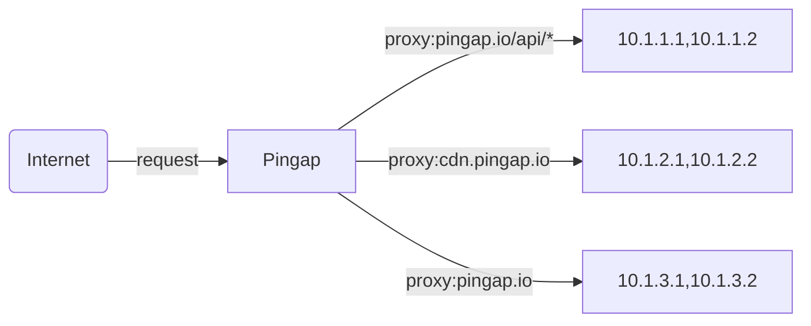
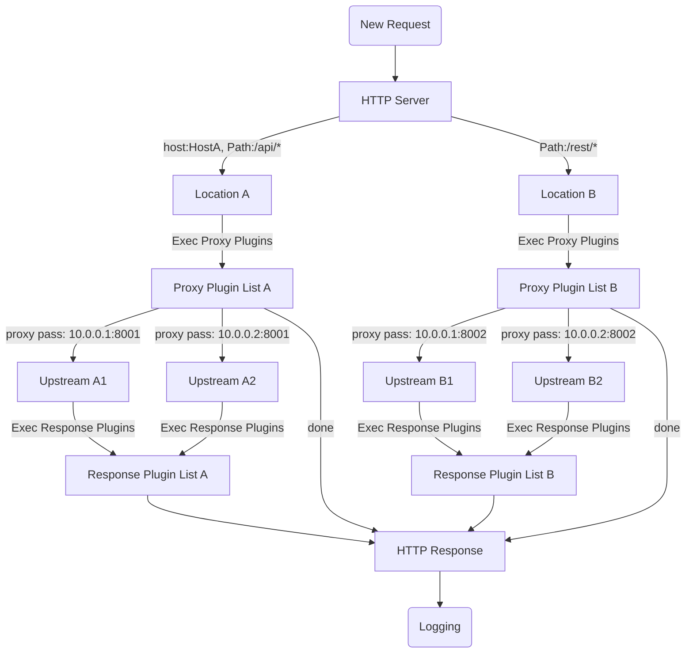

# 1. Run the project

## 1.1 Backend

Open a first terminal and run:

```bash
cd backend
cargo run
```


💁 Troubleshoot
```bash
cargo clean
cargo build
cargo sqlx prepare  # Working
```


## 1.2 Frontend

Open a second terminal and run:

```bash
cargo leptos watch
```


## What is Pingap

A reverse proxy like nginx, built on [pingora](https://github.com/cloudflare/pingora), simple and efficient.

Sentry and opentelemetry are optional, they are supported in the full-featured version.





## Proxy step



